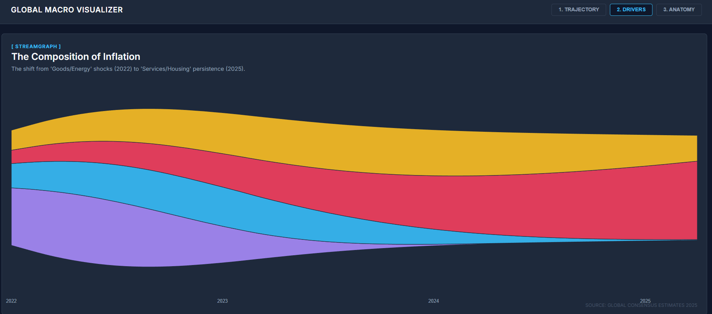
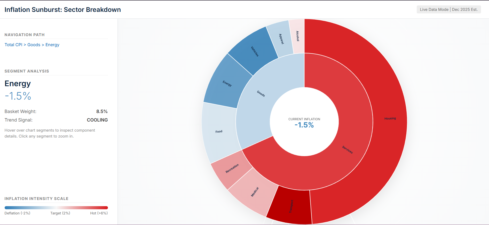
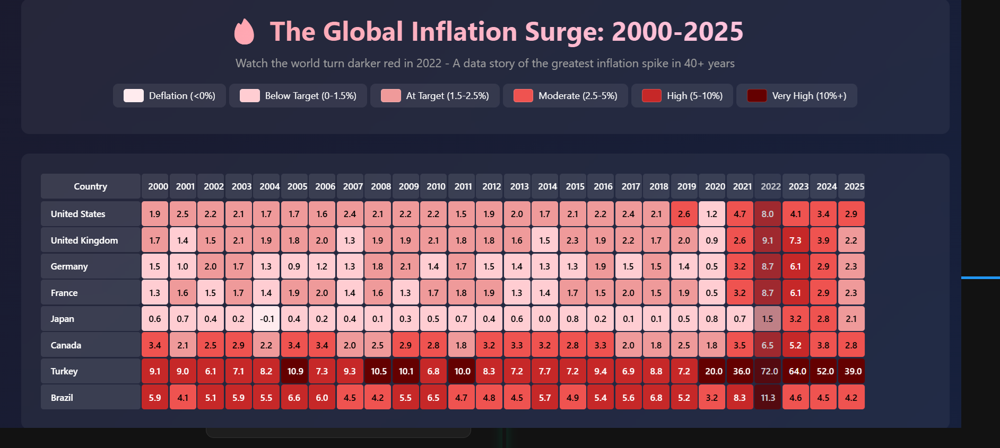
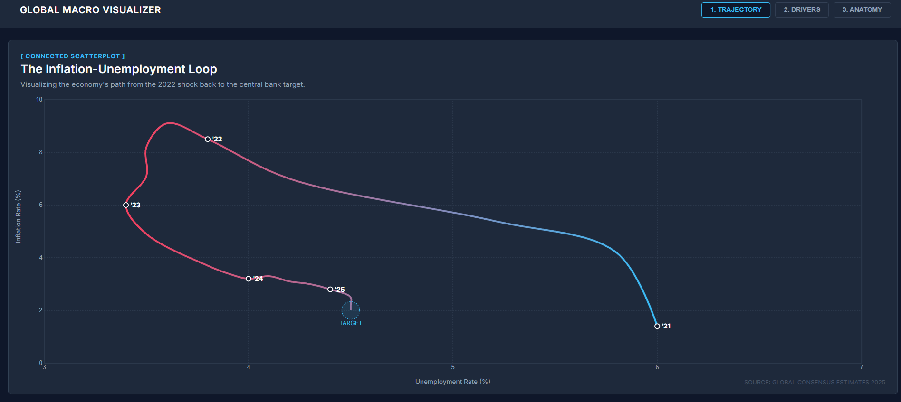

# data-visualization
[![Contributors][contributors-shield]][contributors-url]
[![Forks][forks-shield]][forks-url]
[![Stargazers][stars-shield]][stars-url]
[![Issues][issues-shield]][issues-url]
[![MIT License][license-shield]][license-url]
[![LinkedIn][linkedin-shield]][linkedin-url]

<br />
<p align="center">
  <a href="https://adityathakekar.github.io/data-visualization/">
    
  </a>

  <h3 align="center">Data Visualization Portfolio</h3>

  <p align="center">
    A collection of interactive visual narratives exploring Global Inflation, Purchasing Power, and Spatial Data.
    <br />
    <a href="https://adityathakekar.github.io/data-visualization/"><strong>Explore the docs »</strong></a>
    <br />
    <br />
    <a href="https://adityathakekar.github.io/data-visualization/">View Live Demo</a>
    ·
    <a href="https://github.com/adityathakekar/data-visualization/issues">Report Bug</a>
    ·
    <a href="https://github.com/adityathakekar/data-visualization/issues">Request Feature</a>
  </p>
</p>

<details open="open">
  <summary>Table of Contents</summary>
  <ol>
    <li>
      <a href="#about-the-project">About The Project</a>
      <ul>
        <li><a href="#built-with">Built With</a></li>
      </ul>
    </li>
    <li><a href="#gallery">Gallery</a></li>
    <li><a href="#getting-started">Getting Started</a></li>
    <li><a href="#contact">Contact</a></li>
  </ol>
</details>

## About The Project


This repository serves as a portfolio for advanced data visualization techniques. It moves beyond static charts to create interactive, story-driven experiences. The project is divided into three distinct phases:

1.  **Global Inflation:** A longitudinal study (2014-2025) tracking purchasing power and price segments.
2.  **Business Intelligence:** Executive dashboards and sunburst charts analyzing market dominance.
3.  **Spatial Analysis:** 3D density maps and global price indices (The "Grande Latte Index").

### Built With

This project leverages the power of modern web standards and visualization libraries:

* [![D3][D3.js]][D3-url]
* [![ChartJS][Chart.js]][Chart-url]
* [![ThreeJS][Three.js]][Three-url]
* [![HTML5][HTML5]][HTML5-url]
* [![JavaScript][JavaScript]][JS-url]

## 📸 Gallery

Here are some highlights from the visualizations included in this repo:

| **3D Store Density** | **Market Share Sunburst** |
|:---:|:---:|
|  |  |
| *Experimental 3D visualization of store clusters* | *Interactive radial chart showing market dominance* |

| **Global Price Map** | **Inflation Tracker** |
|:---:|:---:|
|  |  |
| *The interactive Grande Latte Index* | *Longitudinal study on purchasing power* |

## 🚀 Getting Started

To run this project locally, follow these simple steps.

### Prerequisites

* A modern web browser (Chrome, Firefox, Safari).
* A code editor (VS Code recommended).

### Installation

1.  Clone the repo
    ```sh
    git clone [https://github.com/adityathakekar/data-visualization.git](https://github.com/adityathakekar/data-visualization.git)
    ```
2.  Navigate to the project directory
    ```sh
    cd data-visualization
    ```
3.  Open `index.html` in your browser or use a live server extension to view the visualizations.

## 📫 Contact

**Aditya Thakekar** - Embedded Firmware Developer & Data Enthusiast

[![LinkedIn][linkedin-shield]][linkedin-url] [![Website][website-shield]][website-url] [![Mail][mail-shield]][mail-url]

Project Link: [https://github.com/adityathakekar/data-visualization](https://github.com/adityathakekar/data-visualization)

<p align="right">(<a href="#top">back to top</a>)</p>

[contributors-shield]: https://img.shields.io/github/contributors/adityathakekar/data-visualization.svg?style=for-the-badge
[contributors-url]: https://github.com/adityathakekar/data-visualization/graphs/contributors
[forks-shield]: https://img.shields.io/github/forks/adityathakekar/data-visualization.svg?style=for-the-badge
[forks-url]: https://github.com/adityathakekar/data-visualization/network/members
[stars-shield]: https://img.shields.io/github/stars/adityathakekar/data-visualization.svg?style=for-the-badge
[stars-url]: https://github.com/adityathakekar/data-visualization/stargazers
[issues-shield]: https://img.shields.io/github/issues/adityathakekar/data-visualization.svg?style=for-the-badge
[issues-url]: https://github.com/adityathakekar/data-visualization/issues
[license-shield]: https://img.shields.io/github/license/adityathakekar/data-visualization.svg?style=for-the-badge
[license-url]: https://github.com/adityathakekar/data-visualization/blob/master/LICENSE.txt
[linkedin-shield]: https://img.shields.io/badge/-LinkedIn-black.svg?style=for-the-badge&logo=linkedin&colorB=555
[linkedin-url]: https://linkedin.com/in/adityathakekar
[website-shield]: https://img.shields.io/badge/Website-adityathakekar.co.in-blue?style=for-the-badge&logo=google-chrome
[website-url]: https://adityathakekar.co.in
[mail-shield]: https://img.shields.io/badge/Email-Contact%20Me-red?style=for-the-badge&logo=gmail
[mail-url]: mailto:contact@adityathakekar.co.in

[D3.js]: https://img.shields.io/badge/D3.js-F9A03C?style=for-the-badge&logo=d3.js&logoColor=white
[D3-url]: https://d3js.org/
[Chart.js]: https://img.shields.io/badge/Chart.js-FF6384?style=for-the-badge&logo=chartdotjs&logoColor=white
[Chart-url]: https://www.chartjs.org/
[Three.js]: https://img.shields.io/badge/Three.js-black?style=for-the-badge&logo=three.js&logoColor=white
[Three-url]: https://threejs.org/
[HTML5]: https://img.shields.io/badge/HTML5-E34F26?style=for-the-badge&logo=html5&logoColor=white
[HTML5-url]: https://developer.mozilla.org/en-US/docs/Web/Guide/HTML/HTML5
[JavaScript]: https://img.shields.io/badge/JavaScript-F7DF1E?style=for-the-badge&logo=javascript&logoColor=black
[JS-url]: https://developer.mozilla.org/en-US/docs/Web/JavaScript
